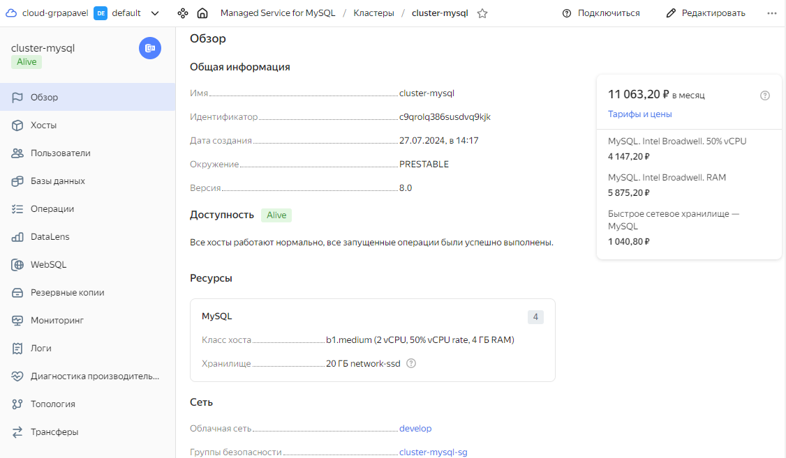
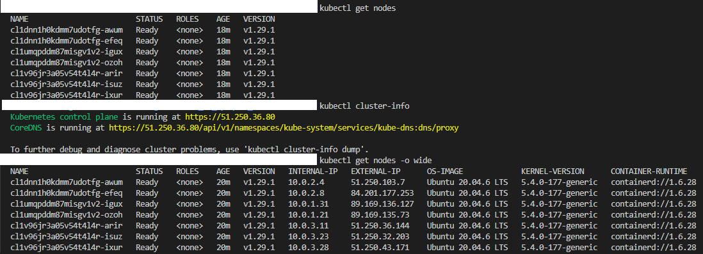
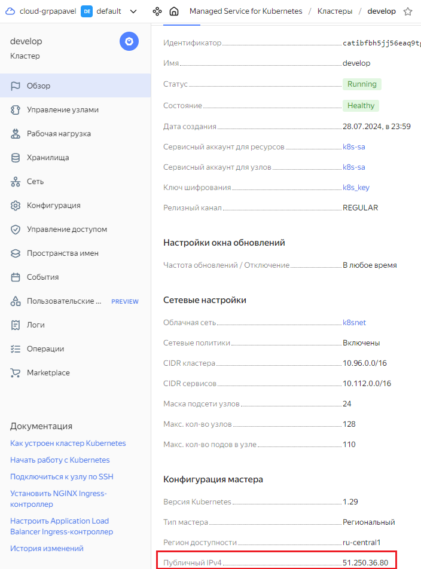

## Задание 1. Yandex Cloud

1. Настроить с помощью Terraform кластер баз данных MySQL.

 - Используя настройки VPC из предыдущих домашних заданий, добавить дополнительно подсеть private в разных зонах, чтобы обеспечить отказоустойчивость. 
 - Разместить ноды кластера MySQL в разных подсетях.
 - Необходимо предусмотреть репликацию с произвольным временем технического обслуживания.
 - Использовать окружение Prestable, платформу Intel Broadwell с производительностью 50% CPU и размером диска 20 Гб.
 - Задать время начала резервного копирования — 23:59.
 - Включить защиту кластера от непреднамеренного удаления.
 - Создать БД с именем `netology_db`, логином и паролем.

2. Настроить с помощью Terraform кластер Kubernetes.

 - Используя настройки VPC из предыдущих домашних заданий, добавить дополнительно две подсети public в разных зонах, чтобы обеспечить отказоустойчивость.
 - Создать отдельный сервис-аккаунт с необходимыми правами. 
 - Создать региональный мастер Kubernetes с размещением нод в трёх разных подсетях.
 - Добавить возможность шифрования ключом из KMS, созданным в предыдущем домашнем задании.
 - Создать группу узлов, состояющую из трёх машин с автомасштабированием до шести.
 - Подключиться к кластеру с помощью `kubectl`.
 - *Запустить микросервис phpmyadmin и подключиться к ранее созданной БД.
 - *Создать сервис-типы Load Balancer и подключиться к phpmyadmin. Предоставить скриншот с публичным адресом и подключением к БД.
 


## 1. Разворачивание кластера БД MySql

1. Существуют следующие классы хостов в yandex cloud:

| Название     | Архитектура процессора    |  Количество памяти и ядер |
|--------------|---------------------------|---------------------------|
| s1.micro     | Intel Broadwell           | 2 ядра и 8 Гб             |
| s1.small     | Intel Broadwell           | 4 ядра и 16 Гб            |
| s1.medium    | Intel Broadwell           | 8 ядра и 32 Гб            |
| s1.large     | Intel Broadwell           | 16 ядра и 64 Гб           |
| s1.xlarge    | Intel Broadwell           | 32 ядра и 128 Гб          |
| b1.medium    | Intel Broadwell           | 2 ядра(50% CPU) и 4 Гб    |
| s2.micro     | Intel Cascade Lake        | 2 ядра и 8 Гб             |
| s2.small     | Intel Cascade Lake        | 4 ядра и 16 Гб            |
| s2.medium    | Intel Cascade Lake        | 8 ядра и 32 Гб            |
| s2.large     | Intel Cascade Lake        | 12 ядра и 48 Гб           |
| s2.xlarge    | Intel Cascade Lake        | 16 ядра и 64 Гб           |
| s2.2xlarge   | Intel Cascade Lake        | 24 ядра и 96 Гб           |
| b2.medium    | Intel Cascade Lake        | 2 ядра(50% CPU) и 4 Гб    |

Для решения используем класс **b1.medium** 

2. Манифест развертывания кластера Mysql расположен в [файле](terraform/main.tf)
   Развертывание осуществляется кодом:
   ```
      module "mysql_cluster" {
        source              = "./modules/mysql"
        folder_id           = var.folder_id
        network_id          = module.mysql_subnet.network_id 
        subnets             = module.mysql_subnet.subnets 
        name                = var.mysql_name 
        environment         = var.mysql_environment 
        version_sql         = var.mysql_version_sql

        resource_preset_id  = var.mysql_preset_id
        disk_type_id        = var.mysql_disk_type_id 
        disk_size           = var.mysql_disk_size 

        deletion_protection = var.mysql_deletion_protection 

        default_db          = var.mysql_default_db

        maintenance_window = {
            type = "ANYTIME"
        }

        backup_window_start = {
            hours   = 23
            minutes = 59
        }

        access = {
            web_sql = true
        }
        
      }
    ```
3. Развертывания кластера реализовано в виде отдельного модуля, расположенного в [папке](terraform/modules/mysql)

    Входящие переменные модуля:
    | Название                  | Значение по умолчанию | Обязательное |   Описание                                                                                    |
    |---------------------------|-----------------------|--------------|-----------------------------------------------------------------------------------------------|
    | folder_id                 | отсутсвует            | X            | Идентификатор папки в облаке. Обязательно для заполнения.                                     |
    | network_id                | отсутсвует            | X            | Идентификатор сети. Принимает выходное значение [модуля subnet](terraform/modules/subnet)     | 
    | name                      | отсутсвует            | X            | Название кластера БД в облаке                                                                 | 
    | environment               | PRESTABLE             |              | Окружение развертывания. Возможные варианты: PRESTABLE и PRODUCTION.                          |
    | version_sql               | 8.0                   |              | Версия сервера. По умолчанию версия '8.0'. Возможные варианты: 5.7 и 8.0                      |
    | mysql_config              | структура             |              | Параметры конфигурации сервера: количество подключений и т.п.                                 |
    | deletion_protection       | true                  |              | Защита от удаления.                                                                           |
    | resource_preset_id        | s1.micro              |              | Класс хоста. s1 соответсвует ядрам Intel Broadwell, s2 соответствует ядрам Intel Cascade Lake |
    | disk_type_id              | network-ssd           |              | Тип диска. Возможные варианты: network-hdd, network-ssd, local-ssd,network-ssd-nonreplicated  |
    | disk_size                 | 20 Гб                 |              | Размер диска. Допустимыми являются значения: <ul> <li>для ssd от 10 до 8192 Гб</li><li> для hdd от 10 до 2048 Гб</li><li>для local-ssd от 368 до 2944 Гб</li><li>для нереплицируемого ssd от 93 до 8184 Гб</li></ul>                                                        |
    | maintenance_window        | ```{type = "ANYTIME"}``` |           | Окно обслуживания(время проведения резервного копирования, сбора статистик). Возможные варианты типов обслуживания: ANYTIME и WEEKLY. Если задан тип обслуживания WEEKLY, то необходимо указать значения начала окна обслуживания: day и hour                            |
    | backup_window_start       | 23:59                 |              | Время начала резерного копирования.                                                           |
    | backup_retain_period_days | 7                     |              | Время хранения резервных копий в днях.                                                        |
    | restore                   | отсутствует           |              | Параметры восстановления. По умолчанию не задано и восстановление не происходит.              | 
    | access                    | ```{data_lens=true, web_sql=true, data_transfer=false }``` | | Доступ к инструментам Yandex DataLens, SQL-запросам из консоли websql и механизму переноса данных из текущего инстанса MySQL в сервис MySql Yandex Cloud (DataTransfer)                                                                              | 
    | allow_ingress_v4_cidr_blocks | ["0.0.0.0/0"]      |              | Разрешенные ip-адреса для подключения к порту кластера 3306. По молчанию разврешены все подключения |
    | default_db                | структура             |              | Параметры создания и подключения к БД по умолчанию.                                           |
    | subnets                   | отсутствует           | X            | Параметры подсетей в которых создаются хосты кластера. Тип список объектов. Каждый объект включает в себя следующие свойства: <ul><li> zone - зона доступности</li><li> name - имя подсети</li><li>cidr - ip-адрес подсеть</li><li> subnet_id - идентификатор подсети возвращенный [модулем subnet](terraform/modules/subnet) </li><ul> |

В итоге был развернут кластер Mysql:


## 2. Разворачивание кластера k8s

1. Манифест развертывания кластера kubernetes расположен в [файле](terraform/main.tf)
   Развертывание осуществляется кодом:
   ```
      module "k8s"{
        source           = "./modules/k8s"
        folder_id        = var.folder_id
        public_key       = var.public_key
        network_id       = module.k8s_subnet.network_id
        subnets          = module.k8s_subnet.subnets 
        k8s_version      = "1.29"
      }
   ```
2. Развертывания кластера реализовано в виде отдельного модуля, расположенного в [папке](terraform/modules/k8s_regional)

    Входящие переменные модуля:
    | Название                  | Значение по умолчанию | Обязательное |   Описание                                                                                       |
    |---------------------------|-----------------------|--------------|--------------------------------------------------------------------------------------------------|
    | folder_id                 | отсутсвует            | X            | Идентификатор папки в облаке. Обязательно для заполнения.                                        |
    | network_id                | отсутсвует            | X            | Идентификатор сети. Принимает выходное значение [модуля subnet](terraform/modules/subnet)        | 
    | name                      | develop               |              | Название кластера в облаке                                                                       |
    | public_key                | отсутствует           | X            | Публичный ssh-ключ                                                                               |
    | account_name              | k8s-sa                |              | Сервисный аккаунт под которым создается кластер                                                  |
    | kms_key_name              | k8s_key               |              | Имя симметричного ключа шифрования                                                               |
    | k8s_version               | 1.29                  |              | Версия kubernetes кластера. Разрешены версии 1.27, 1.28 и 1.29                                   |
    | subnets                   | отсутствует           | X            | Параметры подсетей в которых создаются хосты кластера. Тип список объектов. Каждый объект включает в себя следующие свойства: <ul> <li> zone - зона доступности</li><li> name - имя подсети</li><li>cidr - ip-адрес подсеть</li><li> subnet_id - идентификатор подсети возвращенный [модулем subnet](terraform/modules/subnet) </li><ul> <p> Количество подсетей должно быть равно                                                           |
    | scalepolicy               | структура             |              | Параметры масштабирования. Возможны два типа масштабирования: autoscale и fixed_scale            |
    | node_acceleration         | standard              |              | Тип ускорения сети. Возможные значения: standard(без повышенной производительности) и software-accelerated(с повышенной производительностью)                                                                                                                |
    | node_platform             | standard-v2           |              | Тип используемых ядер. standard-v1 соответвует Intel Broadwell(e5-2660), standard-v2 соответствует Intel Cascade Lake, standard-v3 соответствует Intel Ice Lake. Допустимые варианты: standard-v2 или standard-v3                                                        |
    | vms_resources             | структура             |              | Количество ядер, памяти, тип диска, размер диска, доступность из публичной сети                  |
    | network_provider          | calico                |              | Провайдер сети                                                                                   |


3. Ограничения: 
   - В региональном кластере размещение нод возможно либо в одной локации, либо в разных. Таким образом, использовать две подсети одной зоны доступности нельзя.
   - В зоне **ru-central1-d** отсутсвует поддержка ядер Intel Broadwell, поэтому платформу **standard-v1** скрип не поддерживает
   - Для платформы **standard-v1**  минимальный размер диска равен 30 Гб. Минимальный размер памяти равен 2 Гб.
   - Для платформы **standard-v2**  минимальный размер диска равен 64 Гб. Минимальный размер памяти равен 2 Гб. 
   - Региональный кластер должен иметь 3 подсети, по одной в каждой из зон доступности.

4. Добавляем учетные данные кластера Kubernetes в конфигурационный файл kubectl:
   ```yc managed-kubernetes cluster get-credentials --id <идентификатор кластера> --external```
   
5. Проверяем доступность кластера командами ```kubectl cluster-info``` и ```kubectl get nodes -o wide```:
   

В итоге в консоли Yandex видим региональный кластер, который был развернут в 3 подсетях, расположенных в 3 зонах доступности:



## 3. Полезные документы:

- [Статья проразворачивание кластера K8s](https://habr.com/ru/companies/nixys/articles/721404/).

